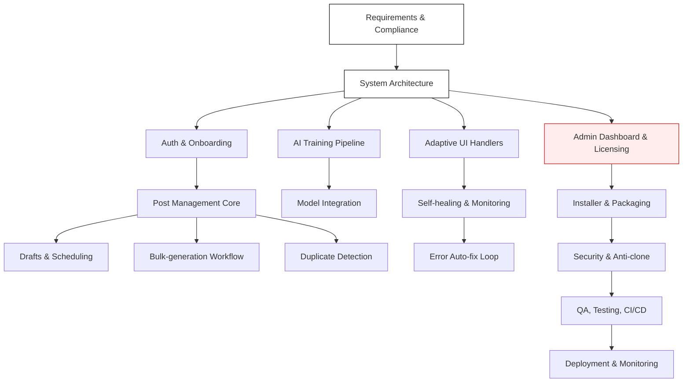

**Development Flow**

Short flow steps:
- Requirements & Compliance: document legal, platform TOS, and risk controls.
- Architecture: service boundaries, DB, queue, worker, UI, AI components.
- Auth: license checks, device binding, RBAC.
- Core: CRUD for posts, groups, pages, account types.
- Drafts/Scheduling: save, queue, cron workers, timezone handling.
- Bulk-safe: prepare batches, preview, hold-and-fire publish.
- Handlers: DOM field discovery, resilient selectors, selector store.
- AI: seed-data training, incremental learning, inference service.
- Self-healing: runtime detection of UI changes, auto-repair handlers.
- Admin: license mgmt, package tiers, device limits, audit logs.
- Installer: cross-platform packaging, silent install, updater.
- Security: code obfuscation, tamper detection, server-side checks.
- QA/CI: unit, integration, e2e, simulated FB sandbox runs.
- Deploy: monitoring, alerts, rollback, telemetry (non-sensitive).
